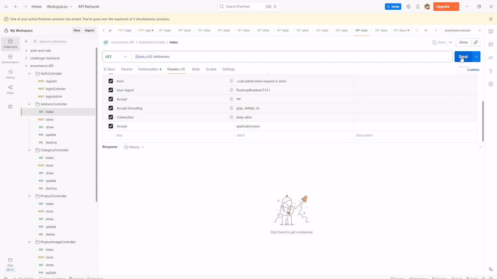
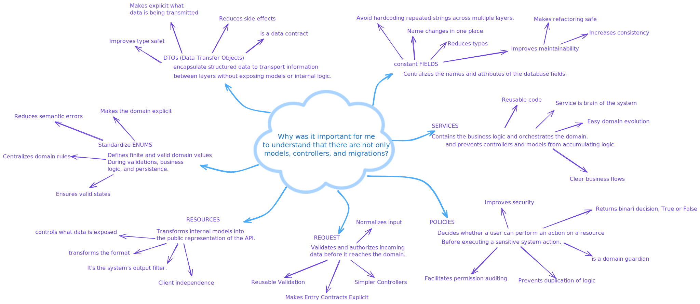
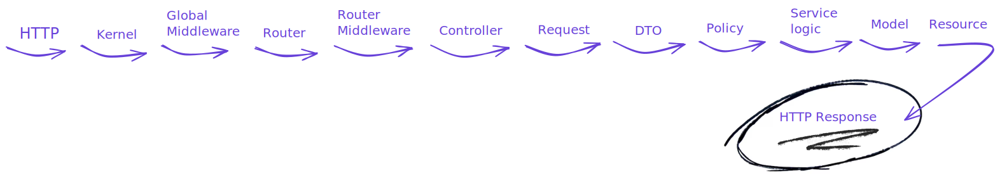

# E-Commerce API - Laravel

**Note:** This is a project I created for educational purposes, not for production use.

Complete RESTful API for an e-commerce system developed with Laravel 11, including product management, shopping carts, orders, payments, and shipping.



---

## Table of Contents

- [Features](#features)
- [Technologies](#technologies)
- [Prerequisites](#prerequisites)
- [Installation](#installation)
- [Configuration](#configuration)
- [Project Structure](#project-structure)
- [API Endpoints](#api-endpoints)
- [Authentication](#authentication)
- [Models and Relationships](#models-and-relationships)
- [Seeders](#seeders)
- [Validations and Business Rules](#validations-and-business-rules)
- [Authorization Policies](#authorization-policies)
- [Author](#author)

---

## My conceptual understanding of Laravel architecture

Traditional MVC explanations often focus mainly on Controllers and Models, but real applications typically require additional layers to properly handle validation, authorization, data transformation, and business logic.

Knowing what exists beyond the Controller and the Model helps design cleaner architectures, reduce coupling, and keep responsibilities well separated.

This diagram represents my conceptual view of how application responsibilities extend beyond the traditional MVC structure, showing how different layers collaborate to handle data, enforce rules, and execute business logic.



Understanding the request lifecycle helps developers reason about application flow, enforce separation of concerns, and design maintainable systems.
This diagram represents my conceptual understanding of how a HTTP request flows through the application



---

## Features

### User Management

- ✅ Registration and authentication with Laravel Sanctum
- ✅ Role and permission system (Spatie Permission)
- ✅ Roles: Admin and Customer
- ✅ Multiple addresses per user (maximum 3)

### Product Catalog

- ✅ Complete CRUD for products
- ✅ Hierarchical categories (categories and subcategories)
- ✅ Multiple images per product with main image
- ✅ Tag system for products
- ✅ Stock and inventory control
- ✅ Active/inactive states

### Shopping Cart

- ✅ One cart per user
- ✅ Add/update/remove items from cart
- ✅ Automatic total calculation

### Order System

- ✅ Order creation from cart
- ✅ Order states (pending, paid, shipped, processing, delivered, cancelled, returned)
- ✅ Order items with historical prices
- ✅ Association with shipping addresses

### Payments and Shipping

- ✅ Multiple payment methods (cash, cards, transfer, PayPal, MercadoPago)
- ✅ Payment states (unpaid, pending, paid, failed, refunded)
- ✅ Shipment tracking system
- ✅ Shipping states (pending, in_transit, delivered, failed)

### Security and Authorization

- ✅ Authorization policies (Policies) for all resources
- ✅ Request validation with Form Requests
- ✅ DTOs (Data Transfer Objects) for data transfer
- ✅ Centralized constants with Fields classes

---

## Technologies

- **Framework:** Laravel 11
- **Database:** MySQL/PostgreSQL/SQLite
- **Authentication:** Laravel Sanctum
- **PHP:** >= 8.2
- **Composer:** >= 2.0

## Prerequisites

- PHP >= 8.2
- Composer
- MySQL/PostgreSQL/SQLite
- Node.js and NPM (optional, for assets)

---

## Installation

### 1. Clone the repository

```bash
git clone https://github.com/maruccimauro/full-ecommerce-laravel.git
cd full-ecommerce-laravel
```

### 2. Install dependencies

```bash
composer install
```

### 3. Configure the environment file

```bash
cp .env.example .env
```

Edit the `.env` file with your database configurations:

```env
DB_CONNECTION=mysql
DB_HOST=127.0.0.1
DB_PORT=3306
DB_DATABASE=your_database
DB_USERNAME=your_username
DB_PASSWORD=your_password
```

### 4. Generate the application key

```bash
php artisan key:generate
```

### 4. Run the migrations

```bash
php artisan migrate
```

### 5. Run the seeders

```bash
php artisan db:seed
```

This will create:

- 2 test users (admin and customer) + 100 additional users
- 5 main categories with subcategories
- 20 products with images
- Shopping carts
- Addresses
- Sample orders
- Product tags

### 6. Start the server

```bash
php artisan serve
```

The application will be available at `http://localhost:8000`

---

## Configuration

### Test Users

After running the seeders, you will have access to:

**Administrator:**

- Email: `admin@gmail.com`
- Password: `123123`
- Role: Admin

**Customer:**

- Email: `customer@gmail.com`
- Password: `123123`
- Role: Customer

### Sanctum Configuration

The project uses Laravel Sanctum for API authentication. Make sure in your `.env`:

```env
SANCTUM_STATEFUL_DOMAINS=localhost,127.0.0.1
```

## Project Structure

<details open>
<summary>📁 Project</summary>

```
Laravel Ecommerce/
├── app/
│   ├── DTOs/
│   │   ├── Address/
│   │   ├── Auth/
│   │   ├── Cart/
│   │   ├── CartItem/
│   │   ├── Category/
│   │   ├── Order/
│   │   ├── Product/
│   │   ├── ProductImage/
│   │   └── Tag/
│   ├── Enums/
│   ├── Fields/
│   ├── Http/
│   │   ├── Controllers/
│   │   ├── Requests/
│   │   │   ├── Address/
│   │   │   ├── Auth/
│   │   │   ├── Cart/
│   │   │   ├── CartItem/
│   │   │   ├── Category/
│   │   │   ├── Order/
│   │   │   ├── Product/
│   │   │   └── ProductImage/
│   │   └── Resources/
│   │       ├── Address/
│   │       ├── Auth/
│   │       ├── Cart/
│   │       ├── CartItem/
│   │       ├── Category/
│   │       ├── Order/
│   │       ├── OrderItem/
│   │       ├── Product/
│   │       └── ProductImage/
│   ├── Models/
│   ├── Policies/
│   ├── Providers/
│   └── Services/
│       ├── Address/
│       ├── Auth/
│       ├── Cart/
│       ├── CartItem/
│       ├── Category/
│       ├── Order/
│       ├── Product/
│       └── ProductImage/
└── database/
    ├── factories/
    ├── migrations/
    └── seeders/

```

</details>

---

## API Endpoints

### Authentication

```http
POST   /api/register          # User registration (public)
POST   /api/login             # Login (public)
```

<hr width="50%">

### Products

```http
GET    /api/products          # List products (public)
GET    /api/products/{id}     # View product (public)

POST   /api/products          # Create product (authenticated)
PUT    /api/products/{id}     # Update product (authenticated)
DELETE /api/products/{id}     # Delete product (authenticated)
```

<hr width="50%">

### Categories

```http
GET    /api/categories        # List categories (public)
GET    /api/categories/{id}   # View category (public)

POST   /api/categories        # Create category (authenticated)
PUT    /api/categories/{id}   # Update category (authenticated)
DELETE /api/categories/{id}   # Delete category (authenticated)
```

<hr width="50%">

### Addresses

```http
GET    /api/addresses         # List user's addresses (authenticated)
GET    /api/addresses/{id}    # View address (authenticated)
POST   /api/addresses         # Create address (authenticated)
PUT    /api/addresses/{id}    # Update address (authenticated)
DELETE /api/addresses/{id}    # Delete address (authenticated)
```

<hr width="50%">

### Cart

```http
GET    /api/carts             # List user's carts (authenticated)
GET    /api/carts/{id}        # View specific cart (authenticated)
POST   /api/carts             # Create cart (authenticated)
PUT    /api/carts/{id}        # Update cart (authenticated)
DELETE /api/carts/{id}        # Delete cart (authenticated)
```

<hr width="50%">

### Cart Items

```http
GET    /api/cartitems         # List cart items (authenticated)
GET    /api/cartitems/{id}    # View cart item (authenticated)
POST   /api/cartitems         # Add item to cart (authenticated)
PUT    /api/cartitems/{id}    # Update item (authenticated)
DELETE /api/cartitems/{id}    # Delete item (authenticated)
```

<hr width="50%">

### Orders

```http
GET    /api/orders                     # List user's orders (authenticated)
POST   /api/orders                     # Create order (authenticated)
GET    /api/orders/{id}/cartitems      # View order with its items (authenticated)
```

<hr width="50%">

### Product Images

```http
GET    /api/productImages              # List product images (authenticated)
GET    /api/productImages/{id}         # View product image (authenticated)
POST   /api/productImages              # Create product image (authenticated)
PUT    /api/productImages/{id}         # Update product image (authenticated)
DELETE /api/productImages/{id}         # Delete product image (authenticated)
```

<hr width="50%">

### Products

```http
GET    /api/products          # List products (public)
GET    /api/products/{id}     # View product (public)

POST   /api/products          # Create product (admin)
PUT    /api/products/{id}     # Update product (admin)
DELETE /api/products/{id}     # Delete product (admin)
```

<hr width="50%">

### Categories

```http
GET    /api/categories        # List categories (public)
GET    /api/categories/{id}   # View category (public)

POST   /api/categories        # Create category (admin)
PUT    /api/categories/{id}   # Update category (admin)
DELETE /api/categories/{id}   # Delete category (admin)
```

<hr width="50%">

### Addresses

```http
GET    /api/addresses         # List user's addresses
GET    /api/addresses/{id}    # View address
POST   /api/addresses         # Create address
PUT    /api/addresses/{id}    # Update address
DELETE /api/addresses/{id}    # Delete address
```

<hr width="50%">

### Cart

```http
GET    /api/carts             # View user's cart
POST   /api/carts             # Create cart
GET    /api/carts/{id}        # View specific cart
PUT    /api/carts/{id}        # Update cart
DELETE /api/carts/{id}        # Delete cart
```

<hr width="50%">

### Cart Items

```http
GET    /api/cartitems         # List cart items
GET    /api/cartitems/{id}    # View item
POST   /api/cartitems         # Add item to cart
PUT    /api/cartitems/{id}    # Update item
DELETE /api/cartitems/{id}    # Delete item
```

<hr width="50%">

### Orders

```http
GET    /api/orders                        # List user's orders
POST   /api/orders                        # Create order from cart
GET    /api/orders/{id}/cartitems        # View order with its items
```

<hr width="50%">

### Product Images

```http
GET    /api/productImages         # List images (admin)
GET    /api/productImages/{id}    # View image (admin)
POST   /api/productImages         # Create image (admin)
PUT    /api/productImages/{id}    # Update image (admin)
DELETE /api/productImages/{id}    # Delete image (admin)
```

---

## Authentication

The API uses Laravel Sanctum for token-based authentication.

### Get Token

```bash
POST /api/login
Content-Type: application/json

{
  "email": "admin@gmail.com",
  "password": "123123"
}
```

**Response:**

```json
{
    "message": "La autenticacion fue realizada con exito",
    "data": {
        "id": 1,
        "name": "admin",
        "email": "admin@gmail.com",
        "phone": "+1234567890"
    },
    "token": "1|abcdef123456..."
}
```

### Use Token in Requests

```bash
GET /api/addresses
Authorization: Bearer 1|abcdef123456...
```

---

## Models and Relationships

### **User**

- `hasOne` Cart
- `hasMany` Orders
- `hasMany` Addresses

### **Address**

- `belongsTo` User
- `hasMany` Orders

### **Cart**

- `belongsTo` User
- `hasMany` CartItems

### **CartItem**

- `belongsTo` Cart
- `belongsTo` Product

### **Product**

- `belongsTo` Category
- `hasMany` ProductImages
- `hasMany` CartItems
- `hasMany` OrderItems
- `belongsToMany` Tags

### **ProductImage**

- `belongsTo` Product

### **Category**

- `belongsTo` Category (parent)
- `hasMany` Category (children)
- `hasMany` Products

### **Order**

- `belongsTo` User
- `belongsTo` Address
- `hasMany` OrderItems
- `hasOne` Shipment
- `hasOne` Payment

### **OrderItem**

- `belongsTo` Order
- `belongsTo` Product

### **Payment**

- `belongsTo` Order

### **Shipment**

- `belongsTo` Order

### **Tag**

- `belongsToMany` Products

---

## Seeders

The project includes complete seeders that create:

1. **UserSeeder**: Admin, customer, and 100 random users
2. **CategorySeed**: 5 main categories with subcategories
3. **ProductSeed**: 20 products
4. **ProductImageSeed**: 3 images per product (1 main + 2 secondary)
5. **CartSeed**: One cart per user
6. **CartItemSeed**: 1–8 random items per cart
7. **AddressSeed**: One address per user
8. **OrderSeed**: 1–3 orders per user
9. **OrderItemSeed**: 1–10 products per order
10. **ShipmentSeed**: Shipping information per order
11. **PaymentSeed**: Payment information per order
12. **TagSeed**: 55+ tags for products

---

## Validations and Business Rules

### Addresses

- Maximum 3 addresses per user
- Duplicate addresses are not allowed (same line1, line2, and postal_code)

### Products

- The name must be unique
- Must belong to a valid category
- Can only have one main image

### Cart

- A user can only have one cart
- Quantity must be greater than 0

### Orders

- Can only be created from a cart with items
- Total is automatically calculated
- Cart is cleared after creating the order

### Categories

- Duplicate root categories are not allowed
- Duplicate subcategories under the same parent are not allowed

---

## Authorization Policies

Each resource has its policies defined:

- **AddressPolicy** → Each user can only view, update, or delete their own addresses.
- **CartPolicy** → Cart access is restricted exclusively to its owner.
- **CartItemPolicy** → Users can only manage items belonging to their own cart.
- **CategoryPolicy** → Creating, modifying, and deleting categories is limited to users with administrator role.
- **ProductPolicy** → Only administrators can create, edit, or delete products.
- **ProductImagePolicy** → Product image management is exclusive to administrators.
- **OrderPolicy** → Users can only view their own orders.

---

## Author

Mauro Marucci
